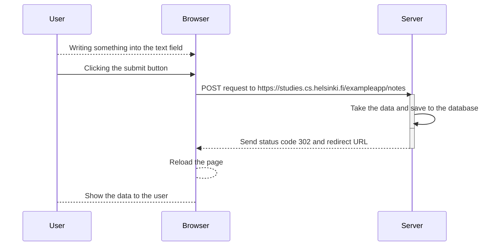

```mermaid
sequenceDiagram
    participant User
    participant Browser
    participant Server

    User-->>Browser: Writing something into the text field
    User->>Browser: Clicking the submit button

    Browser->>Server: POST request to https://studies.cs.helsinki.fi/exampleapp/notes
    activate Server
    Server->>Server: Take the data and save to the database
    deactivate Server

    activate Server
    Server-->>Browser: Send status code 302 and redirect URL
    deactivate Server

    Browser-->Browser: Reload the page
    Browser-->User: Show the data to the user

```

