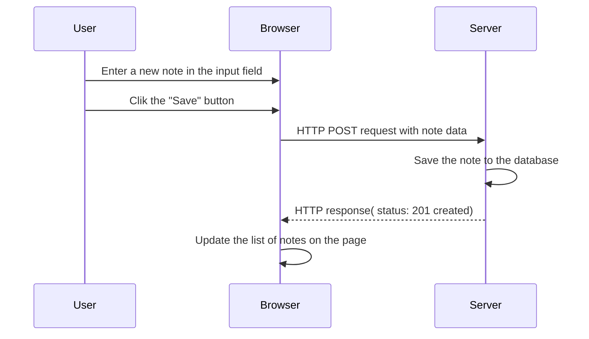

```mermaid
 sequenceDiagram
 	participant User 
	participant Browser 
	participant Server 

	User->>Browser: Enter a new note in the input field
	User->>Browser: Clik the "Save" button 
	Browser->>Server: HTTP POST request with note data 
	Server->>Server: Save the note to the database
	Server-->>Browser: HTTP response( status: 201 created)
	Browser->>Browser: Update the list of notes on the page 
```

