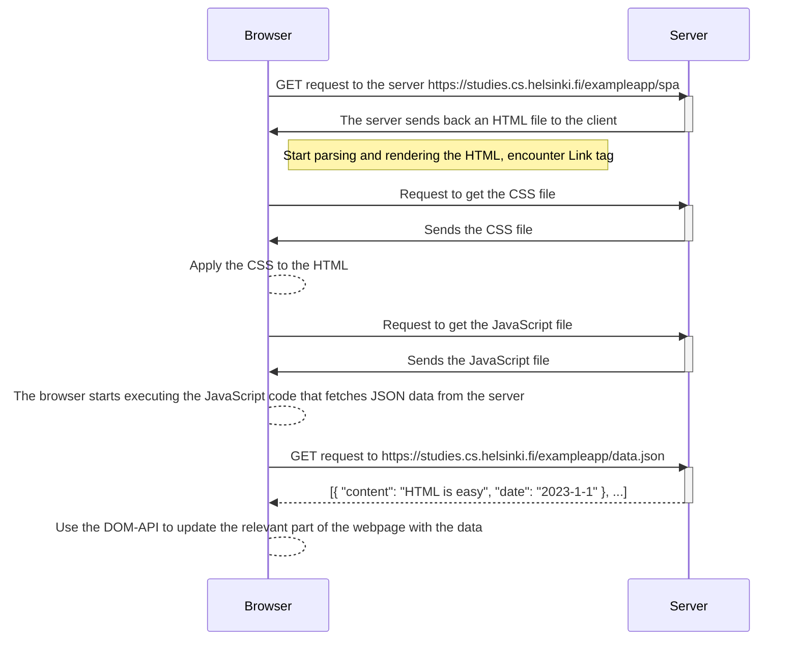

```mermaid
sequenceDiagram
    participant Browser
    participant Server

    Browser->>Server: GET request to the server https://studies.cs.helsinki.fi/exampleapp/spa
    activate Server
    Server->>Browser: The server sends back an HTML file to the client
    deactivate Server
    
    Note right of Browser: Start parsing and rendering the HTML, encounter Link tag

    Browser->>Server: Request to get the CSS file
    activate Server
    Server->>Browser: Sends the CSS file
    deactivate Server
    Browser-->Browser: Apply the CSS to the HTML

    Browser->>Server: Request to get the JavaScript file
    activate Server
    Server->>Browser: Sends the JavaScript file
    deactivate Server
    Browser-->Browser: The browser starts executing the JavaScript code that fetches JSON data from the server

    Browser->>Server: GET request to https://studies.cs.helsinki.fi/exampleapp/data.json
    activate Server
    Server-->>Browser: [{ "content": "HTML is easy", "date": "2023-1-1" }, ...]
    deactivate Server

    Browser-->Browser: Use the DOM-API to update the relevant part of the webpage with the data
```
