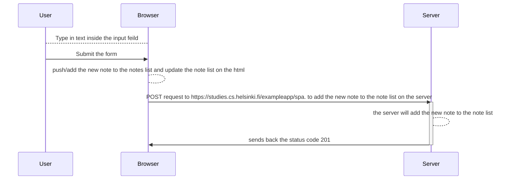

```mermaid
sequenceDiagram
	participant User
	participant Browser 
	participant Server 
	
	User-->Browser: Type in text inside the input feild
	User->>Browser: Submit the form 
	Browser-->Browser: push/add  the new note to the notes list   and update the note list on the html
	Browser->>Server: POST request to  https://studies.cs.helsinki.fi/exampleapp/spa.  to add the new note to the note list on the server 
	activate Server 
	Server-->Server: the server will add the new note to the note list 
	Server->>Browser: sends back the status code 201
	deactivate Server 
	
	

```
